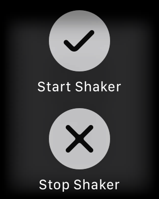

# WatchNote

⌚️ 🤓 Controlling yours Keynote Slides using Apple Watch

# How to Use ?

## Download 

Download this repository and run macOS target or download last binary release [here](https://github.com/ezefranca/WatchNote/files/826468/WatchKeynoteController.zip)

## Start macOS Server

After run `WatchKeynoteController` mac app, go to your status bar and enable the connectivity.

## Connect your iPhone to Server

Download this repository and run iOS/watchOS target or download at AppStore last release [here](https://itunes.apple.com/us/app/watchnotes/id1213397019?ls=1&mt=8)

## Controlling Keynote using Apple Watch

Now, in your Apple Watch, open `WatchNote` app and let's go. Use the buttons to pass foward or back in your slides or do you prefer shaking your wrist? It's possible.

## How it's works?

`macOS` **====<** *MultipeerConnectivity* **>=====<** `iOS` **>=====<** *WatchConnectivity* **>=====<** `watchOS` 

## Disclaimer

Made just for fun.

## Future

~~[x] Add [WatchShaker](https://github.com/ezefranca/WatchShaker) to use your ⌚️ shake movements to change slides.~~ 
Done: [#2](https://github.com/ezefranca/WatchNote/pull/2) 

Thanks to Eliott hauteclair – [@Eliottiosdevs](https://github.com/Eliottiosdevs)

## Contribute

We would love for you to contribute to **WatchNote**, check the ``LICENSE`` file for more info.

## Meta

Ezequiel França – [@ezefranca](https://twitter.com/ezefranca) – ezequiel.ifsp@gmail.com

Distributed under the MIT license. See ``LICENSE`` for more information.
